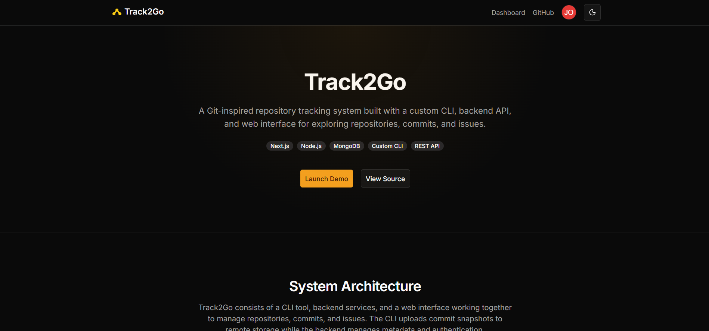
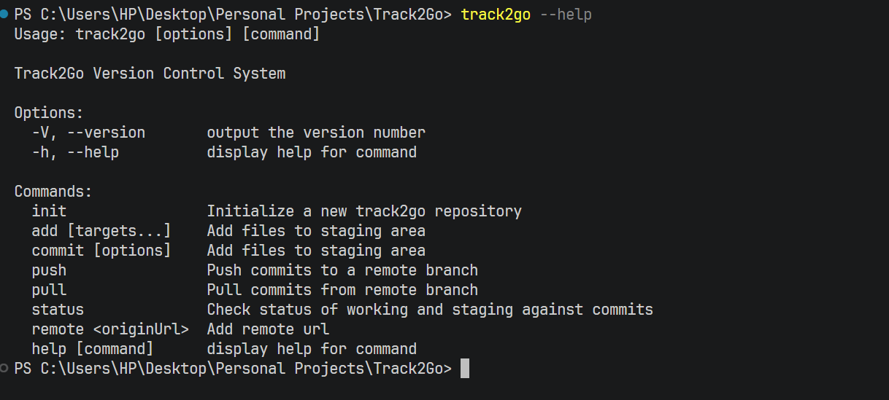
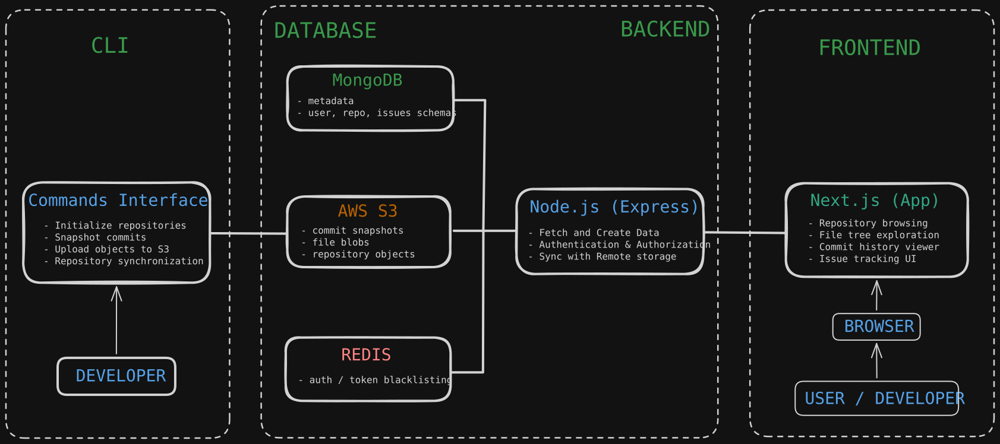

# Track2Go

Track2Go is a **Git-inspired repository tracking platform** that allows developers to manage repositories, commits, files, and issues through both a **CLI tool** and a **web interface**.

It demonstrates how a simplified version control system can be built using modern full-stack technologies.

The project includes:

* A custom CLI for repository operations
* A backend API that manages repository metadata
* Object storage for commit data
* A web dashboard for browsing repositories and files

---

# Web Dashboard & Repository Management
[](https://youtu.be/cxo2JVYgxdQ)

# Complete CLI Workflow (Init → Commit → Push)
[](https://youtu.be/BnLiCTy-_c8)

---

# Features

## Repository Management

* Create repositories
* Public / private repository visibility
* Repository settings page
* Rename repositories
* Delete repositories

## File Browser

* Explore repository files and directories
* Git-style tree navigation
* Breadcrumb navigation
* Syntax highlighting for code files
* Markdown rendering for README files

## Commit History

* View commit history
* Display commit metadata
* Retrieve file snapshots from storage

## Issue Tracking

* Create issues
* View issues per repository
* Issue status tracking

## CLI Tool

Track2Go provides a CLI that enables developers to interact with repositories locally.

Supported commands include:

```
track2go clone <repo-url>
track2go init
track2go add .
track2go commit -m "message"
track2go push
```

The CLI stores commit data and uploads repository snapshots to remote storage.

---

# System Architecture



Track2Go consists of four main components:

## CLI

Handles repository interaction from the developer's local machine.

Responsibilities:

* Command parsing
* Local repository initialization
* Commit creation
* Uploading repository snapshots to remote storage

Tech:

* Node.js
* Commander.js

---

## Backend API

The backend service manages repository metadata and user data.

Responsibilities:

* Authentication
* Repository management
* Issue tracking
* Commit metadata storage
* Synchronization with object storage

Tech:

* Node.js
* Express.js
* Redis
* AWS S3

---

## Database

Stores platform metadata such as users, repositories, and issues.

Tech:

* MongoDB
* Mongoose

Stored data includes:

* user accounts
* repositories
* issues
* repository metadata

---

## Web Frontend

The frontend allows users to explore repositories and manage their projects through a browser.

Features include:

* Repository dashboard
* File explorer
* Commit history viewer
* Issue management
* Repository settings

Tech:

* Next.js (App Router)
* TailwindCSS
* Shadcn UI
* SWR

---

# Tech Stack

Frontend

* Next.js
* TailwindCSS
* Shadcn UI
* SWR
* Lucide Icons

Backend

* Node.js
* Express.js
* MongoDB
* Redis

Infrastructure

* AWS S3 (object storage)
* Docker (planned)
* AWS EC2 (backend hosting)
* Vercel (frontend deployment)

CLI

* Node.js
* Commander.js

---

# Project Structure

```
Track2Go
│
├── client      # Next.js frontend
├── server      # Express backend
├── cli         # Track2Go command line tool
│
├── docs
│   └── system_design.png
│
└── README.md
```

---

# Running Locally

## Backend

```
cd server
npm install
npm run dev
```

Environment variables required:

```
MONGO_URI=
JWT_SECRET=
S3_BUCKET=
AWS_ACCESS_KEY=
AWS_SECRET_KEY=
```

---

## Frontend

```
cd client
npm install
npm run dev
```

---

## CLI

```
cd cli
npm install
npm link
```

Now the CLI can be used globally.

---

# Future Improvements

Planned improvements include:

* CLI authentication
* Repository starring
* Repository search
* Activity graphs
* Branch support
* Pull requests
* Dockerized deployment

---

# Deployment

Frontend is deployed using **Vercel**.

Backend is hosted on **AWS EC2**.

Object storage uses **AWS S3**.

---

# Author

Hrishi
Computer Engineering Student

---

If you want, I can also give you a **much stronger “GitHub-level README” version** (with badges, demo GIF, architecture links, etc.) that makes the project look **significantly more impressive to recruiters.**
